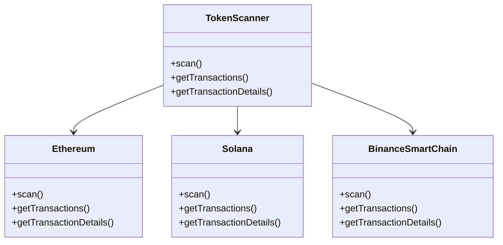

# token-scanner

The Night Watch Guild for Crypto Transactions on the Ethereum, Solana, and
Binance Smart Chain networks.

## Architecture

### Decisions

> Imagine a world where we can scan the blockchain for transactions and expose
> those transactions to the world in a way that is easy to understand and useful
> for on-chain analysis. This is the goal of the Night Watch Guild.

- Follows REST architecture
- Ultrafast (~100ms response time)
- Simple, initutive interface for Querying Data (GET)
- Fully containerized using Docker
- And, Bootstrapped using Docker Compose

### System Design

**The Architecture**

**Proposed API Design**

Below is the proposed API design for the Night Watch Guild. The API will provide endpoints for scanning the blockchain and retrieving transactions.

Resource URI: `/api/v1/tokens/pools`
- Method: `GET`

Example Request:

```bash
  curl -sSL http://localhost:8000/api/v1/tokens/pools?chain_id=solana&token_addresses=ADDRESS1,ADDRESS2
```

**Relationship diagram**



### How It Works

1. The user sends a request to the API to scan the blockchain for transactions.
2. The API calls the appropriate blockchain scanner (Ethereum, Solana, or
   Binance Smart Chain) to scan the blockchain.
3. The scanner scans the blockchain and returns the transactions to the API.

## Usage

## Contributing

Pull requests are welcome. For major changes, please open an issue first to discuss what you would like to change.

## License

This project is licensed under the Apache-2.0 License - see the [LICENSE](LICENSE) file for details.
