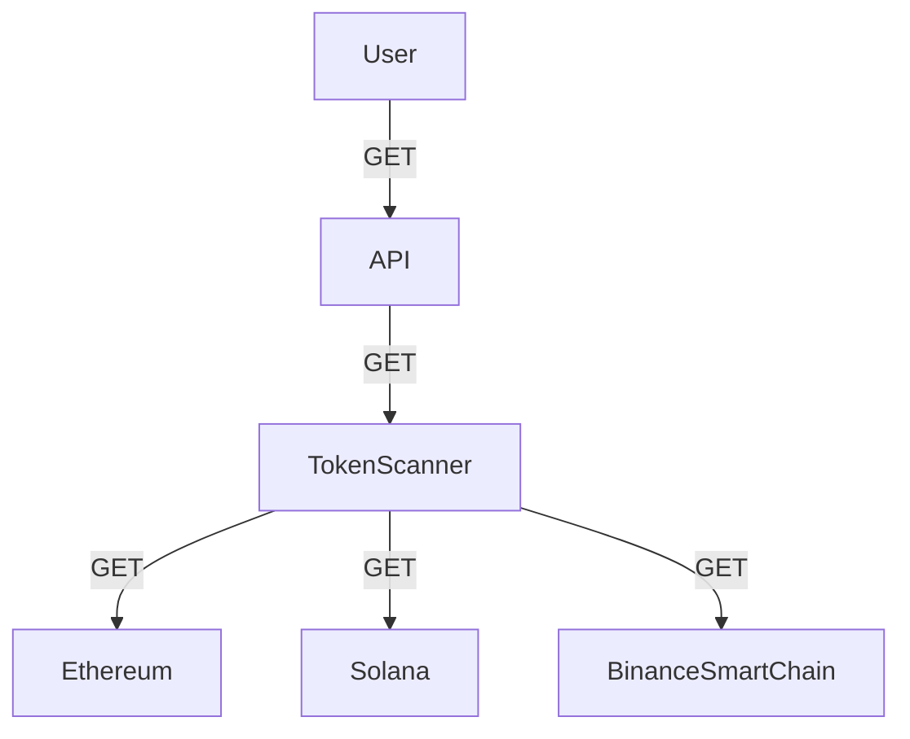
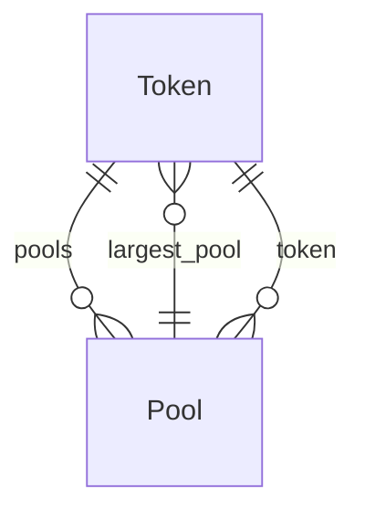

# token-scanner

[](https://github.com/50-Course/token-scanner/actions/workflows/ci.yml)

The Night Watch Guild for Crypto Transactions on the Ethereum, Solana, and
Binance Smart Chain networks.

## Architecture

### Decisions

> Imagine a world where we can scan the blockchain for transactions and expose
> those transactions to the world in a way that is easy to understand and useful
> for on-chain analysis. This is the goal of the Night Watch Guild.

- Follows REST architecture
- Fast (~2s response time)
- Simple, initutive interface for Querying Data (GET)
- Fully containerized using Docker
- And, Bootstrapped using Docker Compose

### System Design

**The Architecture**

Token Scanner is designed to be a simple and efficient way to scan the
blockchain for transactions. It provides a single API endpoint that allows
users to scan a blockchain for transactions. At the moment, only three on-chain
scans are permitted; `Ethereum`, `Solana` and `Binance Smart Chain` (ongoing support/development).



**Proposed API Design**

Below is the proposed API design for the Night Watch Guild. The API will provide endpoints for scanning the blockchain and retrieving transactions.

Resource URI: `/api/v1/tokens/pools`
- Method: `GET`

Example Request:

```bash
  curl -sSL http://localhost:8000/api/v1/tokens/pools?chain_id=solana&token_addresses=ADDRESS1,ADDRESS2
```

**Relationship diagram**



### How It Works

1. The user sends a request to the API to scan the blockchain for transactions.
2. The API calls the appropriate blockchain scanner (Ethereum, Solana, or
   Binance Smart Chain) to scan the blockchain.
3. The scanner scans the blockchain and returns the transactions to the API.

## Usage

### Prerequisites

- Docker
- Docker Compose
- Python 3.12 or higher
- Poetry

### Installation

1. Clone the repository:

   ```bash
   git clone https://github.com/50-Course/token-scanner.git

    cd token-scanner
    ```
2. Install dependencies using Poetry:

   ```bash
   poetry install
   ```
3. Build and run the Docker containers:

   ```bash
    docker-compose up --build
    ```
4. Access the API at `http://localhost:8000/api/v1/tokens/pools` (local).
5. Use the API to scan the blockchain for transactions. See the [API
   documentation]() for more details.

## Contributing

Pull requests are welcome. For major changes, please open an issue first to discuss what you would like to change.

## License

This project is licensed under the Apache-2.0 License - see the [LICENSE](LICENSE) file for details.
